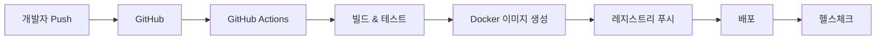

# Noti Service CI/CD 가이드라인

## 1. 개요

본 문서는 Noti Service의 CI/CD 파이프라인 구축 및 운영을 위한 표준 가이드라인입니다. User Service의 CI/CD 패턴을 기반으로 작성되었습니다.

## 2. CI/CD 아키텍처



## 3. 사전 요구사항

### 3.1 필수 도구
- Git
- Java 21
- Gradle 8.5+
- Docker 24.0+
- GitHub 계정

### 3.2 필수 설정
- GitHub Personal Access Token (PAT)
- Docker Hub 계정
- 환경별 설정 파일 준비
- SMTP 서버 정보 (이메일 발송용)
- Discord Webhook URL (Discord 알림용)

## 4. GitHub Actions 워크플로우

### 4.1 CI Pipeline (`.github/workflows/ci.yml`)
- **트리거**: Push to main/develop/feature branches, Pull requests
- **작업**:
  - Java 21 환경 설정
  - Gradle 캐시 활용
  - 단위 테스트 실행
  - 코드 품질 검사
  - JAR 빌드
  - 테스트 리포트 생성

### 4.2 CD Pipeline (`.github/workflows/cd.yml`)
- **트리거**: Push to main branch, Manual dispatch
- **작업**:
  - JAR 빌드
  - Docker 이미지 빌드 및 푸시
  - 환경별 배포 (staging/production)
  - 헬스체크
  - Slack 알림

### 4.3 PR Validation (`.github/workflows/pr-validation.yml`)
- **트리거**: Pull request events
- **작업**:
  - 코드 스타일 검사
  - 보안 스캔 (Trivy)
  - 의존성 취약점 검사
  - 테스트 커버리지 확인
  - Docker 빌드 검증

### 4.4 Release Pipeline (`.github/workflows/release.yml`)
- **트리거**: Git tag push (v*)
- **작업**:
  - GitHub Release 생성
  - JAR 아티팩트 업로드
  - Docker 이미지 태깅 및 푸시

## 5. 로컬 개발 환경

### 5.1 Docker Compose 실행

```bash
# 전체 스택 실행 (인프라 포함)
./gradlew dockerUp

# Noti Service만 실행 (인프라가 이미 실행 중일 때)
./gradlew dockerUpNotiOnly

# 컨테이너 중지
./gradlew dockerDown
./gradlew dockerDownNotiOnly

# 로그 확인
./gradlew dockerLogs
./gradlew dockerLogsNotiOnly
```

### 5.2 빌드 및 테스트

```bash
# 테스트 실행
./gradlew test

# JAR 빌드
./gradlew clean build

# Docker 이미지 빌드
./gradlew dockerBuild

# CI 파이프라인 로컬 실행
./scripts/ci-build.sh
```

## 6. 배포 프로세스

### 6.1 자동 배포

1. `develop` 브랜치 → Staging 환경 자동 배포
2. `main` 브랜치 → Production 환경 자동 배포

### 6.2 수동 배포

```bash
# Staging 배포
./scripts/deploy.sh staging

# Production 배포
./scripts/deploy.sh production v1.0.0

# 헬스체크
./scripts/health-check.sh production

# 롤백
./scripts/rollback.sh
```

## 7. 환경 변수 관리

### 7.1 필수 환경 변수

```bash
# Application
SPRING_PROFILES_ACTIVE=docker
SERVER_PORT=8084

# Database
SPRING_DATASOURCE_URL=jdbc:mysql://mysql:3306/notidb
SPRING_DATASOURCE_USERNAME=noti
SPRING_DATASOURCE_PASSWORD=noti1234

# Eureka
EUREKA_CLIENT_SERVICE_URL_DEFAULTZONE=http://eureka:8761/eureka/

# Email
MAIL_HOST=smtp.gmail.com
MAIL_PORT=587
MAIL_USERNAME=your-email@gmail.com
MAIL_PASSWORD=your-app-password

# Discord
DISCORD_WEBHOOK_URL=https://discord.com/api/webhooks/...
```

### 7.2 GitHub Secrets

Repository Settings > Secrets에 설정:
- `DOCKER_USERNAME`
- `DOCKER_PASSWORD`
- `SLACK_WEBHOOK_URL`
- `MAIL_USERNAME`
- `MAIL_PASSWORD`
- `DISCORD_WEBHOOK_URL`

## 8. 모니터링 및 헬스체크

### 8.1 Actuator Endpoints

- Health: `http://localhost:8084/actuator/health`
- Info: `http://localhost:8084/actuator/info`
- Metrics: `http://localhost:8084/actuator/metrics`
- Prometheus: `http://localhost:8084/actuator/prometheus`

### 8.2 헬스체크 스크립트

```bash
# 로컬 환경 헬스체크
./scripts/health-check.sh local

# Production 환경 헬스체크
./scripts/health-check.sh production
```

## 9. 문제 해결

### 9.1 빌드 실패

```bash
# Gradle 캐시 정리
./gradlew clean
rm -rf ~/.gradle/caches

# 의존성 새로고침
./gradlew --refresh-dependencies
```

### 9.2 Docker 문제

```bash
# Docker 캐시 정리
docker system prune -a

# 네트워크 재생성
docker network create asyncsite-network

# 볼륨 재생성
docker volume create asyncsite-mysql-data
```

### 9.3 데이터베이스 연결 실패

1. MySQL 컨테이너 상태 확인: `docker ps | grep mysql`
2. 데이터베이스 존재 확인: `docker exec -it asyncsite-mysql mysql -p`
3. 네트워크 연결 확인: `docker network inspect asyncsite-network`

## 10. 보안 고려사항

1. **시크릿 관리**: 절대 환경 변수나 비밀번호를 코드에 하드코딩하지 않음
2. **이미지 스캔**: 모든 Docker 이미지는 Trivy로 보안 스캔
3. **의존성 검사**: 정기적인 의존성 취약점 검사
4. **액세스 제어**: Production 배포는 승인된 사용자만 가능

## 11. 성능 최적화

### 11.1 빌드 최적화
- Gradle 빌드 캐시 활용
- Docker 레이어 캐시 최적화
- 병렬 테스트 실행

### 11.2 런타임 최적화
- JVM 힙 크기 조정: `-Xmx512m -Xms256m`
- 데이터베이스 커넥션 풀 최적화
- 비동기 처리 스레드 풀 조정

## 12. 체크리스트

### 12.1 배포 전 체크리스트
- [ ] 모든 테스트 통과
- [ ] 코드 리뷰 완료
- [ ] 환경 변수 설정 확인
- [ ] 데이터베이스 마이그레이션 준비
- [ ] 롤백 계획 수립

### 12.2 배포 후 체크리스트
- [ ] 헬스체크 통과
- [ ] 주요 기능 스모크 테스트
- [ ] 로그 모니터링
- [ ] 성능 메트릭 확인
- [ ] 알림 발송 테스트