# Enhanced Notification Service Design & Architecture

## 🏗️ Enhanced System Architecture

### Improved Sequence Diagram


### Enhanced ERD

```mermaid
erDiagram
    notifications {
        bigint notification_id PK "알림 고유 ID"
        int user_id FK "수신자 ID"
        string event_type "이벤트 타입 (STUDY_APPROVED, STUDY_REJECTED 등)"
        string title "알림 제목"
        string content "알림 내용"
        json metadata "추가 메타데이터"
        enum status "발송 상태 (PENDING, SENT, FAILED, RETRY)"
        datetime created_at "생성 일시"
        datetime sent_at "발송 일시"
        datetime updated_at "수정 일시"
        int retry_count "재시도 횟수"
        string error_message "오류 메시지"
    }

    notification_channels {
        bigint channel_id PK "채널 고유 ID"
        bigint notification_id FK "알림 ID"
        enum channel_type "채널 타입 (EMAIL, DISCORD, PUSH)"
        string recipient "수신자 정보"
        enum status "채널별 발송 상태"
        datetime sent_at "발송 일시"
        string external_id "외부 서비스 ID"
        json response_data "외부 서비스 응답"
    }

    notification_templates {
        bigint template_id PK "템플릿 ID"
        string event_type "이벤트 타입"
        enum channel_type "채널 타입"
        string language "언어 코드"
        string title_template "제목 템플릿"
        string content_template "내용 템플릿"
        json variables "템플릿 변수"
        boolean is_active "활성 상태"
        datetime created_at "생성 일시"
        datetime updated_at "수정 일시"
    }

    notification_settings {
        int user_id PK "사용자 ID"
        boolean study_updates "스터디 관련 알림"
        boolean marketing "마케팅 알림"
        boolean email_enabled "이메일 활성화"
        boolean discord_enabled "Discord 활성화"
        boolean push_enabled "푸시 알림 활성화"
        string timezone "사용자 시간대"
        json quiet_hours "알림 금지 시간"
        datetime created_at "생성 일시"
        datetime updated_at "수정 일시"
    }

    notification_history {
        bigint history_id PK "히스토리 ID"
        bigint notification_id FK "알림 ID"
        enum action "액션 (CREATED, SENT, FAILED, READ)"
        json details "상세 정보"
        datetime created_at "발생 일시"
    }

    notifications ||--o{ notification_channels : "has"
    notifications ||--o{ notification_history : "tracks"
    notification_templates ||--o{ notifications : "generates"
    notification_settings ||--o{ notifications : "configures"

```



```

3. **Database Schema Implementation:**
Create Flyway migration files for the enhanced ERD schema with proper indexes, constraints, and foreign key relationships.

4. **Core Features to Implement:**

**A. REST API Endpoints:**
- POST /api/v1/notifications - Send notification
- GET /api/v1/notifications/{id} - Get notification status
- GET /api/v1/notifications - List notifications with pagination
- POST /api/v1/notifications/{id}/retry - Retry failed notification
- PUT /api/v1/users/{userId}/notification-settings - Update user settings
- GET /api/v1/users/{userId}/notification-settings - Get user settings

**B. Email Service:**
- HTML email templates using Thymeleaf
- Template variables replacement
- Email sending with retry mechanism
- Bounce handling
- Support for attachments

**C. Discord Service:**
- Discord webhook integration
- Message formatting with embeds
- Error handling and retry logic
- Rate limiting compliance

**D. Template Engine:**
- Dynamic template loading from database
- Multi-language support
- Variable substitution
- Template validation

**E. Notification Processing:**
- Async processing with @Async
- Retry mechanism with exponential backoff
- Status tracking and logging
- User preference checking

5. **Configuration Properties:**
```yaml
application:
  notification:
    email:
      enabled: true
      retry-attempts: 3
      retry-delay: 5000
    discord:
      enabled: true
      webhook-url: ${DISCORD_WEBHOOK_URL}
      retry-attempts: 3
    async:
      core-pool-size: 5
      max-pool-size: 10
      queue-capacity: 100

```

1. **Error Handling & Validation:**
    - Global exception handler
    - Input validation with Bean Validation
    - Custom exceptions for different scenarios
    - Proper HTTP status codes
2. **Testing Requirements:**
    - Unit tests with JUnit 5 and Mockito
    - Integration tests with @SpringBootTest
    - TestContainers for database testing
    - Mock external services (Discord, Email)
3. **Monitoring & Logging:**
    - Structured logging with Logback
    - Actuator endpoints for health checks
    - Metrics collection
    - Request/response logging
4. **Security:**
    - Input sanitization
    - Rate limiting
    - API key authentication (prepare for future)
    - CORS configuration

**Implementation Guidelines:**

- Use Builder pattern for complex objects
- Implement proper exception handling
- Add comprehensive Javadoc comments
- Follow Spring Boot best practices
- Use factory pattern for notification channel creation
- Implement strategy pattern for different notification types
- Add proper logging at all levels
- Use transactions appropriately
- Implement circuit breaker pattern for external services
- Add health checks for dependencies

**Sample Request/Response Format:**

```json
// POST /api/v1/notifications
{
  "userId": 123,
  "eventType": "STUDY_APPROVED",
  "metadata": {
    "studyTitle": "Java Spring Boot Study",
    "approvedBy": "Admin",
    "studyUrl": "https://example.com/study/123"
  }
}

// Response
{
  "notificationId": 456,
  "status": "PROCESSING",
  "channels": ["EMAIL", "DISCORD"],
  "createdAt": "2024-01-15T10:30:00Z"
}

```

**Future Extensions to Consider:**

- Kafka integration preparation
- Push notification support
- Webhook delivery
- Batch processing
- Analytics and reporting
- A/B testing for templates

```

This enhanced design provides a robust, scalable notification service with proper separation of concerns, comprehensive error handling, and extensibility for future requirements.

```