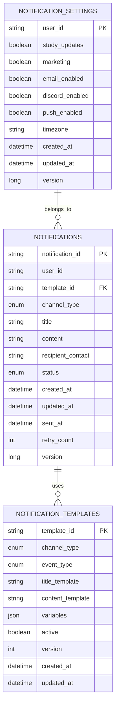
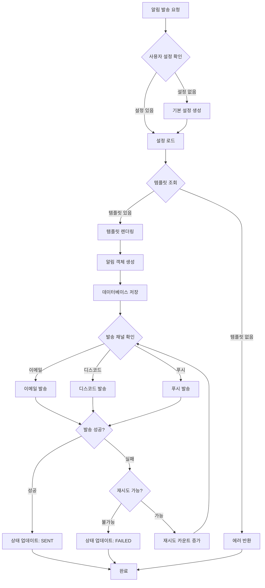
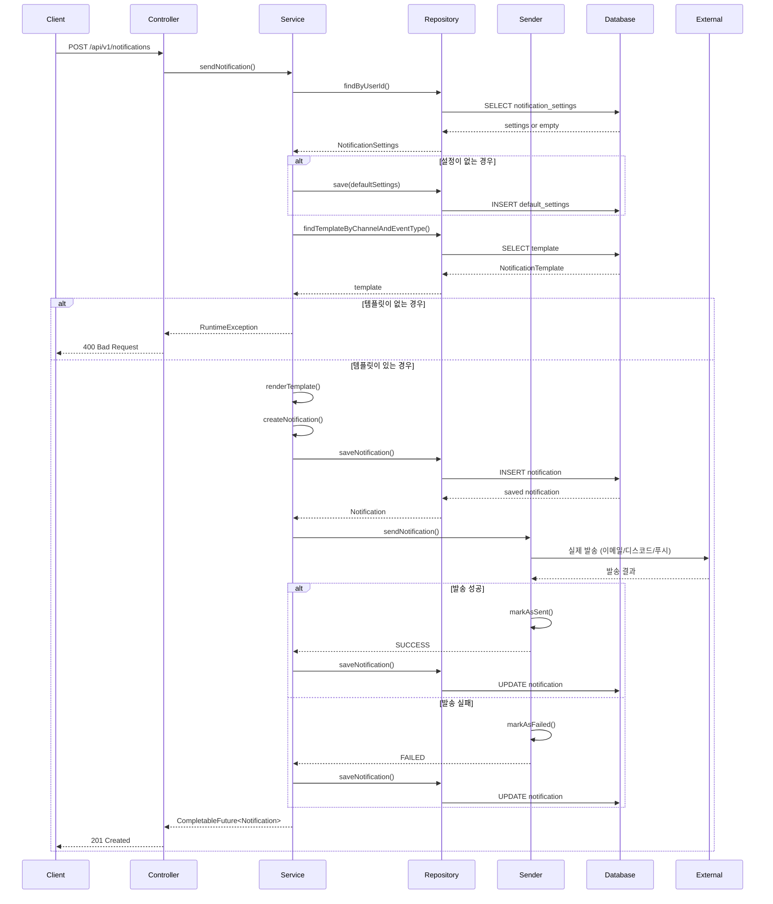

# Noti Service

마이크로서비스 아키텍처 기반의 통합 알림 서비스입니다. 헥사고날 아키텍처(포트&어댑터 패턴)을 적용하여 확장 가능하고 유지보수 가능한 구조로 설계되었습니다.

## 🚀 서비스 개요

Noti Service는 다양한 채널(이메일, 디스코드, 푸시)을 통해 사용자에게 알림을 발송하는 마이크로서비스입니다. 템플릿 기반 알림 시스템을 제공하며, 사용자별 알림 설정 관리 기능을 포함합니다.

### 주요 기능

- **다중 채널 알림 발송**: 이메일, 디스코드, 푸시 알림 지원
- **템플릿 기반 알림**: 동적 변수를 지원하는 알림 템플릿 시스템
- **사용자별 알림 설정**: 채널별, 이벤트별 알림 설정 관리
- **비동기 처리**: 대용량 알림 처리를 위한 비동기 발송 시스템
- **재시도 메커니즘**: 실패한 알림에 대한 자동 재시도 (최대 3회)
- **서비스 디스커버리**: Eureka 기반 마이크로서비스 등록/발견

### 기술 스택

- **Backend**: Spring Boot 3.x, Spring Data JPA, Spring Cloud
- **Database**: MySQL 8.0
- **Message Queue**: Spring Mail (이메일), Discord Webhook (디스코드)
- **Service Discovery**: Netflix Eureka
- **Monitoring**: Spring Actuator, Prometheus
- **Documentation**: Swagger/OpenAPI 3
- **Test**: JUnit 5, Mockito, Spring Boot Test

## 📊 ERD (Entity Relationship Diagram)



## 🔄 플로우차트 (Flow Chart)



## 📋 시퀀스 다이어그램 (Sequence Diagram)



## 🏗️ 아키텍처

이 프로젝트는 헥사고날 아키텍처(포트&어댑터 패턴)을 적용하여 설계되었습니다.

### 패키지 구조

```
com.asyncsite.notiservice
├── domain                    # 도메인 계층 (비즈니스 로직)
│   ├── model                # 도메인 모델
│   │   ├── Notification
│   │   ├── NotificationSettings  
│   │   ├── NotificationTemplate
│   │   └── vo               # Value Objects
│   └── port                 # 포트 인터페이스
│       ├── in               # 인바운드 포트 (유스케이스)
│       └── out              # 아웃바운드 포트 (외부 연동)
├── application              # 애플리케이션 계층
│   └── service              # 유스케이스 구현체
├── adapter                  # 어댑터 계층
│   ├── in                   # 인바운드 어댑터
│   │   ├── web              # REST API 컨트롤러
│   │   └── dto              # 요청/응답 DTO
│   └── out                  # 아웃바운드 어댑터
│       ├── persistence      # 데이터베이스 연동
│       └── notification     # 외부 알림 서비스 연동
├── config                   # 설정 클래스
└── common                   # 공통 유틸리티
```

### 핵심 컴포넌트

#### 도메인 모델
- **Notification**: 알림 도메인 모델, 비즈니스 규칙 포함
- **NotificationTemplate**: 템플릿 렌더링 로직 포함
- **NotificationSettings**: 사용자별 알림 설정

#### 포트 (Ports)
- **NotificationUseCase**: 알림 발송 유스케이스
- **NotificationRepositoryPort**: 데이터 저장소 포트
- **NotificationSenderPort**: 외부 발송 서비스 포트

#### 어댑터 (Adapters)
- **NotificationController**: REST API 제공
- **EmailNotificationSender**: 이메일 발송 구현체
- **NotificationPersistenceAdapter**: JPA 기반 저장소 구현체

## 🚀 설치 및 실행

### 사전 요구사항

- Java 17 이상
- MySQL 8.0
- Docker & Docker Compose (선택사항)

### 로컬 환경 설정

1. **프로젝트 클론**
   ```bash
   git clone <repository-url>
   cd noti-service
   ```

2. **데이터베이스 설정**
   ```bash
   # Docker를 사용하는 경우
   docker-compose up -d mysql
   
   # 직접 설치한 MySQL 사용시
   mysql -u root -p < mysql/init/01-create-noti-databases.sql
   ```

3. **환경 변수 설정**
   ```bash
   # application.yml에서 다음 값들을 설정하거나 환경변수로 제공
   export MAIL_USERNAME=your-email@gmail.com
   export MAIL_PASSWORD=your-app-password
   ```

4. **애플리케이션 실행**
   ```bash
   # Gradle 사용
   ./gradlew bootRun
   
   # 또는 JAR 빌드 후 실행
   ./gradlew bootJar
   java -jar build/libs/noti-service-0.0.1-SNAPSHOT.jar
   ```

### Docker를 이용한 실행

```bash
# 전체 서비스 실행 (MySQL, Eureka Server, Noti Service)
docker-compose up -d

# 로그 확인
docker-compose logs -f noti-service
```

## 📚 API 문서

애플리케이션 실행 후 다음 URL에서 API 문서를 확인할 수 있습니다.

- **Swagger UI**: http://localhost:8084/swagger-ui.html
- **OpenAPI JSON**: http://localhost:8084/v3/api-docs

### 주요 API 엔드포인트

#### 알림 발송
```http
POST /api/v1/notifications
Content-Type: application/json

{
  "userId": "user123",
  "channelType": "EMAIL",
  "eventType": "STUDY",
  "recipientContact": "user@example.com",
  "metadata": {
    "userName": "홍길동",
    "progress": 85
  }
}
```

#### 알림 조회
```http
GET /api/v1/notifications/{notificationId}
GET /api/v1/notifications?userId=user123&channelType=EMAIL&page=0&size=20
```

#### 알림 설정 관리
```http
GET /api/v1/users/{userId}/notification-settings
PUT /api/v1/users/{userId}/notification-settings
POST /api/v1/users/{userId}/notification-settings/reset
```

#### 템플릿 관리
```http
GET /api/v1/notification-templates?channelType=EMAIL&active=true
POST /api/v1/notification-templates
PUT /api/v1/notification-templates/{templateId}
```

## 🧪 테스트

### 테스트 실행

```bash
# 모든 테스트 실행
./gradlew test

# 특정 테스트 클래스 실행
./gradlew test --tests NotificationServiceTest

# 통합 테스트만 실행
./gradlew test --tests "*IntegrationTest"
```

### 테스트 구조

- **단위 테스트**: 도메인 모델, 서비스, 컨트롤러별 독립적 테스트
- **통합 테스트**: 전체 플로우 테스트
- **테스트 커버리지**: 주요 비즈니스 로직 90% 이상

## 📊 모니터링

### Health Check

```bash
# 애플리케이션 상태 확인
curl http://localhost:8084/actuator/health

# 상세 정보 포함
curl http://localhost:8084/actuator/health?include=details
```

### Metrics

```bash
# 메트릭 정보
curl http://localhost:8084/actuator/metrics

# Prometheus 형식
curl http://localhost:8084/actuator/prometheus
```

## 🔧 설정

### 주요 설정 값

| 설정 키 | 기본값 | 설명 |
|--------|--------|------|
| `server.port` | 8084 | 서버 포트 |
| `spring.datasource.url` | `jdbc:mysql://localhost:3306/notidb` | 데이터베이스 URL |
| `spring.mail.host` | `smtp.gmail.com` | SMTP 서버 |
| `eureka.client.service-url.defaultZone` | `http://localhost:8761/eureka/` | Eureka 서버 |

### 프로파일별 Thymeleaf 주의사항 및 WebFlux 제거 계획 (2025-08-16)

- 운영(docker,microservices) 프로필에서도 템플릿 리졸브가 확실하도록 `application-docker.yml`에 다음을 명시합니다.
  ```yaml
  spring:
    thymeleaf:
      prefix: classpath:/templates/
      suffix: .html
      cache: true
  ```
- noti-service는 MVC + 동기 I/O 중심이므로 `spring-boot-starter-webflux`를 제거하고 Discord 전송은 RestTemplate로 전환할 계획입니다. WebFlux 공존 시 자동구성 경계로 인해 Thymeleaf 리졸브가 흔들릴 수 있으므로 정리합니다.

### 프로파일별 설정

- **default**: 로컬 개발 환경
- **test**: 테스트 환경 (H2 인메모리 DB 사용)
- **prod**: 운영 환경

## 🤝 기여하기

1. Fork the Project
2. Create your Feature Branch (`git checkout -b feature/amazing-feature`)
3. Commit your Changes (`git commit -m 'Add some amazing feature'`)
4. Push to the Branch (`git push origin feature/amazing-feature`)
5. Open a Pull Request

## 📝 라이선스

이 프로젝트는 MIT 라이선스 하에 배포됩니다. 자세한 내용은 `LICENSE` 파일을 참조하세요.

## 📞 문의

프로젝트에 대한 문의사항이 있으시면 이슈를 생성해 주세요. 