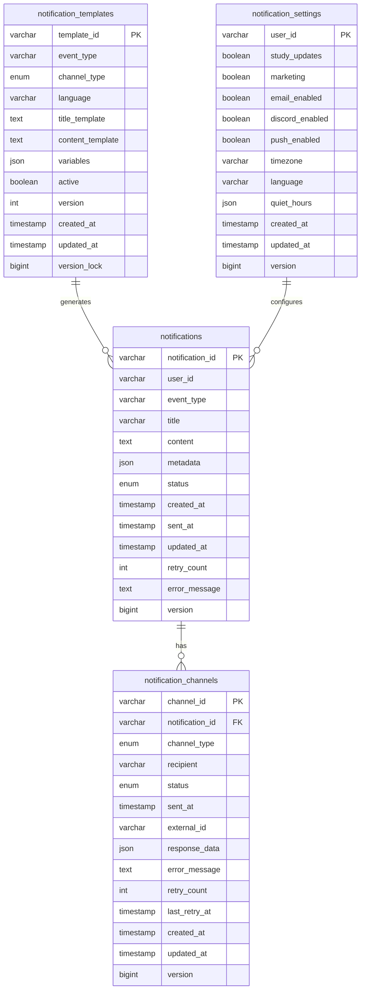

# 🔔 Noti Service

**확장 가능한 마이크로서비스 알림 플랫폼** - Spring Boot 3.x + Java 21 기반의 헥사고날 아키텍처

[](https://openjdk.java.net/projects/jdk/21/)
[](https://spring.io/projects/spring-boot)
[](LICENSE)

## 📋 목차

- [🌟 주요 특징](#-주요-특징)
- [🏗️ 아키텍처](#️-아키텍처)
- [🚀 빠른 시작](#-빠른-시작)
- [📡 API 가이드](#-api-가이드)
- [🗄️ 데이터베이스 설계](#️-데이터베이스-설계)
- [🔧 고급 기능](#-고급-기능)
- [🧪 테스트](#-테스트)
- [📊 모니터링](#-모니터링)
- [🐳 배포](#-배포)

## 🌟 주요 특징

### 🎯 **멀티 채널 알림 지원**
- **이메일** (SMTP, HTML 템플릿)
- **Discord** (Webhook 통합)
- **푸시 알림** (향후 FCM 연동 예정)

### 🏛️ **도메인 중심 설계**
```java
// ✨ 도메인 팩토리 메서드
Notification notification = Notification.create(userId, eventType, title, content, metadata);

// ✨ 도메인 행위 메서드
notification = notification.markAsSent();
notification = notification.prepareRetry();

// ✨ 불변 record 기반 API
public record SendNotificationRequest(
    @NotNull String userId,
    @NotBlank String eventType,
    Map<String, Object> metadata
) {}
```

### 🔄 **강력한 재시도 메커니즘**
- 지수 백오프를 통한 자동 재시도
- 채널별 독립적인 재시도 로직
- 최대 3회까지 재시도 지원
- **93개 단위 테스트**로 검증된 재시도 로직

### 🎨 **동적 템플릿 엔진**
- Mustache 스타일 변수 치환 (`{{variable}}`)
- 다국어 지원 (ko, en, ja 등)
- 채널별 맞춤 템플릿
- 실시간 템플릿 미리보기

### 🔍 **QueryDSL 기반 고급 쿼리**
- 동적 필터링 및 복합 조건 검색
- 실시간 통계 및 집계 기능
- 타입 안전한 쿼리 작성
- 성능 최적화된 대시보드 API

### ⚙️ **세밀한 사용자 설정**
- 이벤트 타입별 알림 제어
- 채널별 활성화/비활성화
- 방해금지 시간 설정 (시간대 고려)
- 주말 전용 방해금지 모드

## 🏗️ 아키텍처

### 헥사고날 아키텍처 (Ports & Adapters)

```
┌─────────────────────────────────────────────────────────────┐
│                     Adapter Layer                           │
├─────────────────────────────────────────────────────────────┤
│  REST Controllers  │   Persistence   │   External Services │
│  (record DTOs)     │   (JPA/MySQL)   │   (Email/Discord)   │
└─────────────────────────────────────────────────────────────┘
                              │
┌─────────────────────────────────────────────────────────────┐
│                  Application Layer                          │
├─────────────────────────────────────────────────────────────┤
│              Use Case Implementations                       │
│         (비즈니스 프로세스 오케스트레이션)                       │
└─────────────────────────────────────────────────────────────┘
                              │
┌─────────────────────────────────────────────────────────────┐
│                    Domain Layer                             │
├─────────────────────────────────────────────────────────────┤
│   Domain Models   │    Ports        │   Business Logic    │
│   (팩토리 메서드)    │  (인터페이스)     │   (도메인 규칙)       │
└─────────────────────────────────────────────────────────────┘
```

### 🎯 **핵심 도메인 모델**

#### 📧 **Notification** - 알림 집합근
```java
public class Notification {
    // 정적 팩토리 메서드
    public static Notification create(String userId, String eventType, ...)
    public static Notification createPending(String userId, String eventType, ...)
    
    // 도메인 행위 메서드
    public Notification markAsSent()
    public Notification markAsFailed(String errorMessage)
    public Notification prepareRetry()
    
    // 버전 관리 (낙관적 락)
    private Long version;
}
```

#### 📱 **NotificationChannel** - 채널별 발송 관리
```java
public class NotificationChannel {
    // 채널별 팩토리 메서드
    public static NotificationChannel createEmailChannel(String notificationId, String email)
    public static NotificationChannel createDiscordChannel(String notificationId, String webhook)
    
    // 발송 상태 관리
    public NotificationChannel markAsSent(String externalId, Map<String, Object> responseData)
    public NotificationChannel markAsFailed(String errorMessage)
}
```

#### 📝 **NotificationTemplate** - 템플릿 관리
```java
public class NotificationTemplate {
    // 채널별 템플릿 생성
    public static NotificationTemplate createEmailTemplate(...)
    public static NotificationTemplate createDiscordTemplate(...)
    
    // 템플릿 렌더링
    public String renderTitle(Map<String, Object> data)
    public String renderContent(Map<String, Object> data)
    
    // 템플릿 검증
    public boolean isValidTemplate()
    public Set<String> extractVariables()
}
```

## 🚀 빠른 시작

### 사전 요구사항
- **Java 21+**
- **Gradle 8.5+**
- **MySQL 8.0+**
- **Docker & Docker Compose** (선택사항)

### 1️⃣ 로컬 개발 환경 설정

```bash
# 1. 레포지토리 클론
git clone https://github.com/your-org/noti-service.git
cd noti-service

# 2. MySQL 실행 (Docker)
docker run -d --name noti-mysql \
  -e MYSQL_ROOT_PASSWORD=root1234 \
  -e MYSQL_DATABASE=notidb \
  -p 3308:3306 \
  mysql:8.0

# 3. 애플리케이션 실행
./gradlew bootRun
```

### 2️⃣ Docker Compose로 전체 스택 실행

```bash
# JAR 빌드
./gradlew clean build

# 전체 서비스 실행
docker-compose up -d

# 로그 확인
docker-compose logs -f noti-service
```

### 3️⃣ 헬스체크 확인

```bash
curl http://localhost:8084/api/v1/notifications/health
curl http://localhost:8084/actuator/health
```

## 📡 API 가이드

### 🔔 알림 발송 API

#### **POST** `/api/v1/notifications`
```json
{
  "userId": "user123",
  "eventType": "STUDY_APPROVED",
  "metadata": {
    "studyTitle": "Java Spring Boot 스터디",
    "userName": "김개발",
    "approvedBy": "관리자",
    "email": "user@example.com",
    "discordWebhook": "https://discord.com/api/webhooks/..."
  }
}
```

**응답**
```json
{
  "notificationId": "noti-abc123",
  "status": "PROCESSING",
  "channels": ["EMAIL", "DISCORD"],
  "createdAt": "2024-07-19T10:30:00Z",
  "estimatedDelivery": "2024-07-19T10:31:00Z"
}
```

#### **GET** `/api/v1/notifications/{notificationId}`
```json
{
  "notificationId": "noti-abc123",
  "userId": "user123",
  "eventType": "STUDY_APPROVED",
  "title": "🎉 스터디 승인: Java Spring Boot 스터디",
  "content": "김개발님의 스터디가 승인되었습니다!",
  "status": "SENT",
  "channels": [
    {
      "channelType": "EMAIL",
      "status": "SENT",
      "sentAt": "2024-07-19T10:30:45Z",
      "recipient": "user@example.com"
    },
    {
      "channelType": "DISCORD",
      "status": "SENT",
      "sentAt": "2024-07-19T10:30:52Z",
      "recipient": "https://discord.com/api/webhooks/..."
    }
  ]
}
```

### ⚙️ 알림 설정 API

#### **GET** `/api/v1/users/{userId}/notification-settings`
#### **PUT** `/api/v1/users/{userId}/notification-settings`
```json
{
  "studyUpdates": true,
  "marketing": false,
  "emailEnabled": true,
  "discordEnabled": true,
  "pushEnabled": false,
  "timezone": "Asia/Seoul",
  "language": "ko",
  "quietHours": {
    "enabled": true,
    "startTime": "22:00",
    "endTime": "08:00",
    "weekendsOnly": false
  }
}
```

### 📝 템플릿 관리 API

#### **POST** `/api/v1/notification-templates`
```json
{
  "eventType": "STUDY_APPROVED",
  "channelType": "EMAIL",
  "language": "ko",
  "titleTemplate": "🎉 스터디 승인: {{studyTitle}}",
  "contentTemplate": "{{userName}}님의 \"{{studyTitle}}\" 스터디가 승인되었습니다!",
  "variables": ["userName", "studyTitle", "approvedBy"],
  "isActive": true
}
```

### 🧪 API 테스트

프로젝트에는 실제 시나리오를 테스트할 수 있는 HTTP 파일들이 포함되어 있습니다:

- 📧 `http/notification.http` - **24개 알림 발송 시나리오**
  - 기본 알림 발송 (이메일, Discord, 푸시)
  - 🧪 **도메인 로직 테스트** - 연속 상태 변경, 최대 재시도, 비즈니스 규칙 검증
  - 🧪 **엣지 케이스** - null 메타데이터, 빈 문자열 처리
  - 📈 **통계 및 모니터링** - 성공률, 상태 세부 정보

- ⚙️ `http/notification-settings.http` - **24개 설정 관리 시나리오**
  - 기본 설정 관리 (이벤트 타입, 채널, 방해금지 시간)
  - 🧪 **도메인 로직 테스트** - 채널별 활성화, 방해금지 시간 경계값
  - 🧪 **엣지 케이스** - null 값 처리, 잘못된 시간 형식
  - 🔧 **유효성 검증** - 설정 검증, 통계 조회

- 📝 `http/notification-template.http` - **29개 템플릿 관리 시나리오**
  - 채널별 템플릿 생성 (이메일, Discord, 푸시)
  - 🧪 **도메인 로직 테스트** - 복잡한 중괄호 패턴, 특수문자 변수명
  - 🧪 **엣지 케이스** - 빈 템플릿, 잘못된 템플릿 패턴
  - 🔧 **템플릿 검증** - 변수 추출, 유효성 검사, 성능 통계

- 📊 `http/notification-channel.http` - **30개 채널 관리 시나리오**
  - 채널 상태 관리 및 재시도 로직
  - 🧪 **도메인 로직 테스트** - 상태 전이, 최대 재시도 처리
  - 🧪 **엣지 케이스** - null 외부 ID, 복잡한 응답 데이터
  - 📈 **통계 및 분석** - 성공률, 재시도 패턴, 오류 분석

- 🔍 `http/notification-querydsl.http` - **30개 QueryDSL 고급 쿼리 시나리오**
  - 🔍 **복합 조건 검색** - 동적 필터링, 페이징, 정렬
  - 📊 **실시간 통계** - 사용자별, 이벤트별, 채널별 집계
  - 📈 **성능 분석** - 성공률, 재시도 패턴, 대시보드 데이터
  - 🧪 **고급 쿼리** - 복잡한 조인, 서브쿼리, 집계 함수

### 🎯 **HTTP 테스트 실행 가이드**

```bash
# 1. 서비스 실행
./gradlew bootRun

# 2. HTTP 클라이언트에서 테스트 실행
# - IntelliJ IDEA: HTTP 파일 열고 각 요청 실행
# - VS Code: REST Client 확장 사용
# - Postman: 파일 import 후 실행
```

## 🗄️ 데이터베이스 설계

### 📊 **ERD 개요**



### 🔧 **주요 테이블**

| 테이블 | 설명 | 주요 필드 |
|--------|------|-----------|
| `notifications` | 알림 메인 테이블 | notification_id (PK), user_id, event_type, status, version |
| `notification_channels` | 채널별 발송 상태 | channel_id (PK), channel_type, recipient, status, version |
| `notification_templates` | 알림 템플릿 | template_id (PK), event_type, channel_type, language, version_lock |
| `notification_settings` | 사용자 알림 설정 | user_id (PK), quiet_hours, timezone, version |

## 🔧 고급 기능

### 🔄 **비동기 처리 & 재시도**

```java
@Async
public CompletableFuture<Notification> sendNotification(
    String userId, 
    String eventType, 
    Map<String, Object> metadata
) {
    // 1. 사용자 설정 검증
    // 2. 템플릿 렌더링
    // 3. 멀티 채널 비동기 발송
    // 4. 결과 집계 및 상태 업데이트
}
```

### 🔍 **QueryDSL 고급 쿼리**

```java
// 동적 필터링을 통한 복잡한 알림 검색
@Override
public Page<NotificationEntity> findNotificationsWithFilters(
        String userId,
        Notification.NotificationStatus status,
        String eventType,
        LocalDateTime startDate,
        LocalDateTime endDate,
        Pageable pageable) {

    BooleanBuilder builder = new BooleanBuilder();
    
    if (userId != null) {
        builder.and(notificationEntity.userId.eq(userId));
    }
    if (status != null) {
        builder.and(notificationEntity.status.eq(status));
    }
    if (eventType != null) {
        builder.and(notificationEntity.eventType.eq(eventType));
    }
    
    return queryFactory
            .selectFrom(notificationEntity)
            .where(builder)
            .orderBy(notificationEntity.createdAt.desc())
            .offset(pageable.getOffset())
            .limit(pageable.getPageSize())
            .fetchResults();
}

// 실시간 통계 집계
@Override
public Map<Notification.NotificationStatus, Long> getNotificationStatistics(
        String userId, LocalDateTime startDate, LocalDateTime endDate) {
    
    return queryFactory
            .select(notificationEntity.status, notificationEntity.count())
            .from(notificationEntity)
            .where(buildDateRangeCondition(startDate, endDate)
                   .and(notificationEntity.userId.eq(userId)))
            .groupBy(notificationEntity.status)
            .transform(groupBy(notificationEntity.status).as(notificationEntity.count()));
}
```

### 🌐 **다국어 및 시간대 지원**

```yaml
# 지원 언어
languages:
  - ko (한국어)
  - en (English)  
  - ja (日本語)

# 지원 시간대
timezones:
  - Asia/Seoul
  - Asia/Tokyo
  - America/New_York
  - Europe/London
```

### 🔕 **방해금지 시간**

```json
{
  "quietHours": {
    "enabled": true,
    "startTime": "22:00",
    "endTime": "08:00", 
    "weekendsOnly": false,
    "timezone": "Asia/Seoul"
  }
}
```

### 📊 **실시간 통계**

- 채널별 발송 성공률
- 일별/주별/월별 통계
- 재시도 패턴 분석
- 사용자 참여도 메트릭

## 🧪 테스트

### 단위 테스트
```bash
# 전체 테스트 실행
./gradlew test

# 도메인 모델 테스트만 실행
./gradlew test --tests "*domain.model.*Test"
```

### 통합 테스트
```bash
./gradlew integrationTest
```

### 테스트 커버리지
```bash
./gradlew jacocoTestReport
open build/reports/jacoco/test/html/index.html
```

### 🎯 **완전한 도메인 모델 테스트 (93개 테스트 케이스)**

#### 📧 **Notification 테스트** (40개 테스트)
- ✅ **정적 팩토리 메서드** - `create()`, `createPending()`, `createFailed()`, `createDisabled()`
- ✅ **상태 전이 로직** - `markAsSent()`, `markAsFailed()`, `prepareRetry()`
- ✅ **비즈니스 규칙** - `canRetry()`, `isCompleted()`, `isProcessing()`
- ✅ **엣지 케이스** - null 메타데이터, 연속 상태 변경, 최대 재시도 도달

#### 📱 **NotificationChannel 테스트** (31개 테스트)
- ✅ **채널별 팩토리** - `createEmailChannel()`, `createDiscordChannel()`, `createPushChannel()`
- ✅ **상태 관리** - `markAsSent()`, `markAsFailed()`, `prepareRetry()`
- ✅ **재시도 로직** - 최대 3회 재시도, 재시도 불가 상태 검증
- ✅ **엣지 케이스** - null 외부 ID, 복잡한 응답 데이터, 빈 수신자

#### ⚙️ **NotificationSettings 테스트** (14개 테스트)
- ✅ **설정 관리** - `createDefault()`, `updateEventSettings()`, `updateChannelSettings()`
- ✅ **방해금지 시간** - 시간대 고려, 자정 넘는 시간, 주말 전용 모드
- ✅ **비즈니스 로직** - `isNotificationAllowed()`, `isInQuietHours()`, `isCompletelyDisabled()`
- ✅ **유효성 검증** - 설정 검증, 방해금지 시간 형식 검사

#### 📝 **NotificationTemplate 테스트** (8개 테스트)
- ✅ **템플릿 생성** - 채널별 템플릿, 다국어 지원, 버전 관리
- ✅ **렌더링 엔진** - `renderTitle()`, `renderContent()`, 변수 치환
- ✅ **템플릿 검증** - `isValidTemplate()`, `extractVariables()`, 중괄호 패턴 처리
- ✅ **엣지 케이스** - 복잡한 중괄호 패턴, 특수문자 변수명, 빈 템플릿

### 🎯 **주요 테스트 영역**

- ✅ **도메인 모델** - 팩토리 메서드, 도메인 행위, 비즈니스 규칙 (93개 테스트)
- ✅ **서비스 계층** - 비동기 처리, 재시도 로직, 예외 상황
- ✅ **API 계층** - record 기반 validation, 에러 핸들링
- ✅ **통합 테스트** - TestContainers 기반 MySQL 연동

### 📊 **테스트 실행 결과**

```bash
BUILD SUCCESSFUL in 1s
93 tests completed, 0 failed

✅ NotificationTest: 40 tests passed
✅ NotificationChannelTest: 31 tests passed  
✅ NotificationSettingsTest: 14 tests passed
✅ NotificationTemplateTest: 8 tests passed
```

## 📊 모니터링

### Actuator 엔드포인트
```bash
# 헬스체크
GET /actuator/health

# 메트릭
GET /actuator/metrics

# Prometheus 메트릭
GET /actuator/prometheus
```

### 📈 **주요 메트릭**

- `notification.sent.total` - 총 발송 건수
- `notification.failed.total` - 실패 건수
- `notification.retry.total` - 재시도 건수
- `notification.channel.{type}.success_rate` - 채널별 성공률

### 🗂️ **로깅**

```yaml
logging:
  level:
    com.asyncsite.notiservice: DEBUG
  pattern:
    console: "%d{yyyy-MM-dd HH:mm:ss} [%thread] %-5level %logger{36} - %msg%n"
  file:
    name: logs/noti-service.log
```

## 🐳 배포

### Docker 이미지 빌드
```bash
# JAR 빌드
./gradlew clean build

# Docker 이미지 빌드
docker build -t noti-service:latest .

# 이미지 실행
docker run -d \
  --name noti-service \
  -p 8084:8084 \
  -e SPRING_PROFILES_ACTIVE=docker \
  noti-service:latest
```

### Kubernetes 배포
```yaml
apiVersion: apps/v1
kind: Deployment
metadata:
  name: noti-service
spec:
  replicas: 3
  selector:
    matchLabels:
      app: noti-service
  template:
    metadata:
      labels:
        app: noti-service
    spec:
      containers:
      - name: noti-service
        image: noti-service:latest
        ports:
        - containerPort: 8084
        env:
        - name: SPRING_PROFILES_ACTIVE
          value: "k8s"
```

### 환경별 설정

| 환경 | 프로파일 | 설명 |
|------|----------|------|
| 로컬 | `local` | 개발 환경, H2 또는 로컬 MySQL |
| 개발 | `dev` | 개발 서버, 실제 외부 서비스 연동 |
| 스테이징 | `staging` | 프로덕션 유사 환경 |
| 프로덕션 | `prod` | 운영 환경, 모든 보안 설정 활성화 |

## 🤝 기여하기

1. **Fork** the repository
2. **Create** your feature branch (`git checkout -b feature/amazing-feature`)
3. **Commit** your changes (`git commit -m 'Add some amazing feature'`)
4. **Push** to the branch (`git push origin feature/amazing-feature`)
5. **Open** a Pull Request

### 개발 가이드라인

- 🏗️ **헥사고날 아키텍처** 원칙 준수
- 🎯 **도메인 중심 설계** - 팩토리 메서드, 도메인 행위 메서드 활용
- 📝 **불변 객체** - record, Builder 패턴 사용
- 🧪 **테스트 우선** - TDD 방식 권장
- 📚 **문서화** - JavaDoc, API 문서 업데이트

## 📄 라이선스

이 프로젝트는 [MIT License](LICENSE) 하에 배포됩니다.

---

## 🔗 관련 링크

- [API 상세 가이드](API_GUIDE.md)
- [Docker 구성 가이드](DOCKER_SETUP_GUIDE.md)
- [개발 가이드라인](CLAUDE.md)
- [프로젝트 설계 문서](PROMPT.md)
- [단위 테스트 가이드](src/test/java/com/asyncsite/notiservice/domain/model/)
- [HTTP API 테스트](http/)

---

**✨ 개발팀**: Core Platform Team  
**📧 문의**: dev@asyncsite.com  
**🐛 이슈 리포트**: [GitHub Issues](https://github.com/your-org/noti-service/issues) 